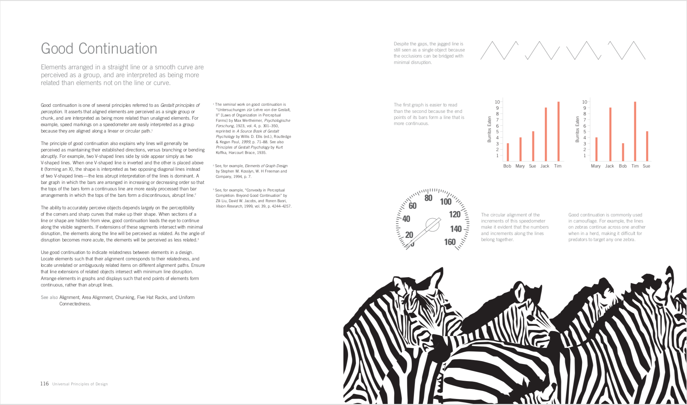
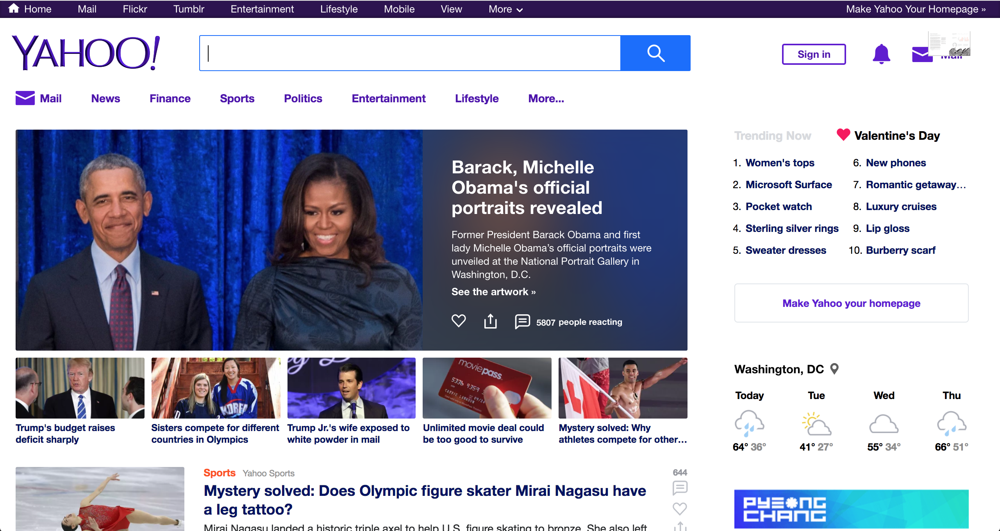

# Interface Design

As web developers it is our job to build products. Whether your applications are built for consumers or internal use, it is important to remember that you are building a product for real people. People who have experience, knowledge, bias, and preference that is uniquely different from yours. **Identify your target user and learn from them.**

## Learning Objectives

- Discuss several general principals of design
- Introduce user experience design (UX)

## Universal Principals of Design

The content in this section is inspired by a book I highly recommend for anyone working in product design. You! *Universal Principles of Design* is exactly what it seems. It is a huge repository of design considerations that can and should be applied to the design of tea kettles, elevators, propaganda, space shuttles, and everything in between.

Today we will touch on a few important considerations when building the interface of a website or application.

### Cost vs Benefit

Closely consider the benefits of using your application. What is the app designed to do? How might it make a user's life easy, happy, healthy, knowledgeable, productive, or fun? While it is fun and easy to imagine our applications' positive impact on users, it is important to remember that there is always an associated cost. Costs come in many forms: money, time, ...decisions?

  
<strong>What aspects of an application may create a cost for users?</strong>

   

- **loading:** People are impatient. The longer a user has to wait, the more likely they are to use an alternative product.
- **sign up:** Forms are annoying and nobody enjoys sharing unnecessary personal information. Unless signing up is critical to an app's benefit, it will be perceived as a cost.
- **onboarding:** It takes time and energy to learn a new skill or tool. Simplify onboarding as much as possible and focus on features that are critical to the core functionality of the app.
- **complexity:** People become overwhelmed by complexity and can become paralyzed if given too many options. Give your app a KISS (Keep it Simple, Stupid!)

#### Hick's Law

Hick's law states that the time it takes to make a decision increases with the number of present choices. Users feel confident, empowered, and happy when they are able to easily navigate an application and they are frustrated when they can't find what they're looking for. Consider Hick's law when designing navigation and menu options. Group related navigation links together. Present the most used functions and hide advanced features for users to learn with time.

  
<strong>How does Netflix utilize Hick's Law to make choosing a show or movie easier for users?</strong>

   

  By presenting rows of related items, Netflix encourages users to first narrow their decision by genre.

  

#### Occam's Razor

Occam's razor is a principle that states that when presented with competing solutions to a problem, choose the one that makes the fewest assumptions (i.e. the simplest one). Favor simplicity over complexity. Superfluous elements decrease an applications efficiency and introduce possibilities for error. Carefully evaluate each piece of your application and determine whether each element contributes to the application's larger function or goal.

Consumers typically choose products that are simple and focused on solving a specific problem.

Minimizing cost is as important as maximizing benefit. Users will never appreciate the value of your application if the investment of time and energy is too great.

### Consistency

The concept of consistency is not new to this course and has been encouraged throughout in reference to writing code.

  
<strong>What are the benefits of writing consistent code?</strong>

   

- visually pleasing
- improves readability
- improves understanding and communication between team members
- removes the need to make frequent style decisions

 

Consistency in interface design is similarly important. Consistent style improves a user's ability to learn and use an application. When links, headers, buttons, font, color, or even page margins are visually and functionally consistent, our application creates reliable expectations for users. This builds trust, comfort, and recognition.

Let's check out [Airbnb](https://www.airbnb.com). What's consistent?

Create constraints when planning the interface of an application. Limit yourself to a few complementary colors, one or two fonts-styles, and a handful of distinct font-size/weight combinations. Organizing page content within a grid creates visual consistency through alignment and whitespace.

Inconsistency can be a powerful tool too, but it should be used sparingly and minimally. Elements that are visually distinct can be used to direct users' attention. To direct attention to your app's most important feature, link, or button, consider altering the element's size, shape, color, or font but NEVER all four. Ensure that any break in consistency still fits naturally within the app's style as a whole.

#### Mimicry

User expectations extend across applications.

 

Mimicry is borrowing *aspects* of a familiar design in order to utilize users' preexisting knowledge or expectations. **Dont reinvent the wheel.**

When building an interface, look to similar applications for inspiration. Is navigation intuitive? Does the choice of color palette elicit a particular feeling or emotion? Is content organized simply? Take aspects you like and modify them to fit the overall style of your application.

Play to user expectations whenever possible. If you make bold decisions about your application's layout, flow, or style, that are contrary to the norm, ask yourself why. If you can't identify a concrete benefit, you're only creating a cost to your user.

### Forgiveness

### Color

### Legibility